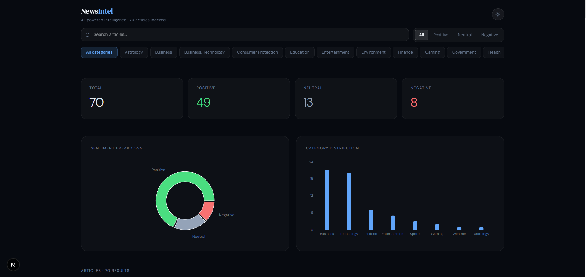
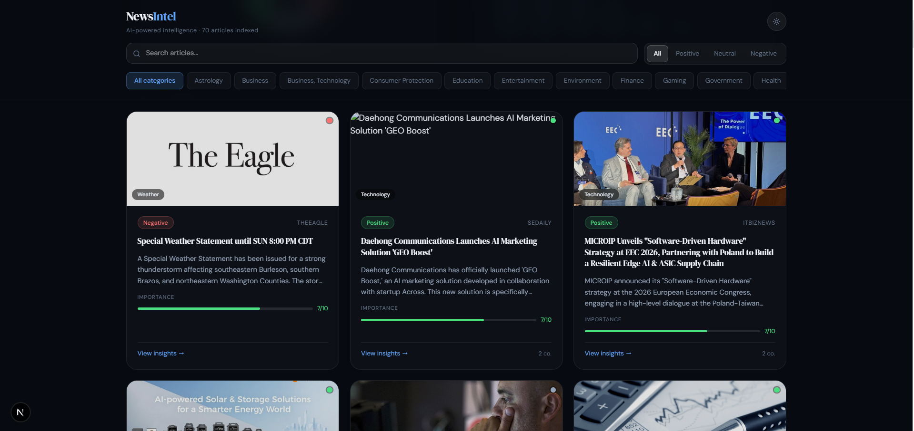
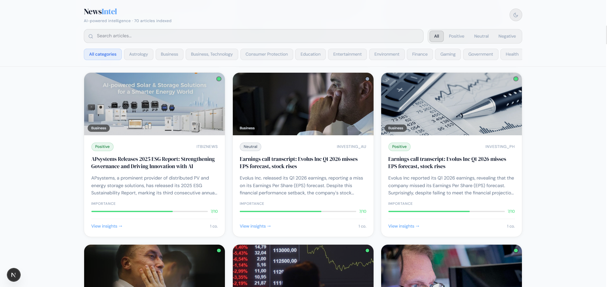

# NewsIntel — AI-Powered News Intelligence Platform

> Automatically fetches real-time news, enriches it with Gemini AI, and surfaces actionable insights through a polished Next.js dashboard.



---

## Overview

NewsIntel is a full-stack news intelligence platform built as part of the Datastraw AI + Tech Intern assessment. It combines an automated n8n data pipeline with a Next.js frontend to deliver a seamless experience — from raw news ingestion all the way to AI-enriched, searchable, filterable article cards with summaries, sentiment analysis, and key insights.

---

## Architecture

```
NewsData.io API
      │
      ▼
┌─────────────────────────────────────────────────────────────┐
│                        n8n Pipeline                         │
│                                                             │
│  Cron Job → Fetch Articles → Split Out → Format for Gemini  │
│       → Gemini AI Enrichment → JS Parser → Shape Data       │
│                    → Supabase (PostgreSQL)                  │
└─────────────────────────────────────────────────────────────┘
      │
      ▼
┌─────────────────────────────────────────────────────────────┐
│                     Next.js Frontend                        │
│                                                             │
│   page.tsx (Server Component)  →  Supabase Query            │
│         → NewsDashboard (Client Component)                  │
│         → Stat Cards, Charts, Article Grid, Modal           │
└─────────────────────────────────────────────────────────────┘
```

---

## Features

### Data Pipeline (n8n)
- **Scheduled ingestion** — Cron trigger fetches fresh articles automatically, no manual intervention needed
- **Pagination & error handling** — HTTP GET node handles NewsData.io pagination and failed requests gracefully
- **Data cleaning** — JavaScript code node validates, cleans, and deduplicates articles before AI processing
- **Gemini AI enrichment** — Each article is sent to the Google Gemini API and returned with:
  - 1–2 sentence summary
  - Sentiment classification (positive / neutral / negative)
  - 3–5 key insights
  - Importance score (0–10)
  - Companies mentioned
- **Supabase upsert** — Enriched articles are written to PostgreSQL via the Supabase REST API, with upsert logic preventing duplicates on re-runs

### Frontend Dashboard (Next.js)
- **Real data** — Reads directly from Supabase, zero mock content
- **Search** — Full-text search across article titles and summaries
- **Sentiment filter** — Filter by positive, neutral, or negative
- **Category filter** — Scrollable category pill strip, dynamically populated from data
- **Stat cards** — Live counts for total, positive, neutral, and negative articles
- **Charts** — Sentiment pie chart and category bar chart via Recharts
- **Article cards** — Image, sentiment badge, source, importance bar, summary preview
- **Article modal** — Full detail view with key points, companies mentioned, importance score, and a direct link to the original article
- **Skeleton loading** — Animated placeholder cards while data loads
- **Dark / light mode** — Toggle with smooth transitions
- **Responsive** — Grid adapts from 1 to 3+ columns based on viewport

---

## Tech Stack

| Layer | Technology | Reason |
|---|---|---|
| Automation | n8n | Visual, low-code pipeline — fast to build, easy to debug and extend |
| News API | NewsData.io | Reliable real-time news with category and pagination support |
| AI | Google Gemini | Strong instruction-following for structured JSON enrichment |
| Database | Supabase (PostgreSQL) | Managed Postgres with a REST API — no backend server needed |
| Frontend | Next.js 14 (App Router) | Server components for zero-client data fetching, excellent DX |
| Charts | Recharts | Composable, lightweight React charting library |
| Fonts | DM Sans + DM Serif Display | Clean, editorial pairing that suits a news product |

---

## Project Structure

```
├── app/
│   └── page.tsx               # Server component — fetches articles from Supabase
├── components/
│   └── ui/
│       └── news-dashboard.tsx # Main dashboard client component
├── lib/
│   └── supabase.ts            # Supabase client initialisation
├── public/
│   └── screenshots/           # Dashboard screenshots for README
├── .env.example               # Required environment variables (template)
├── .env.local                 # Your actual keys — never committed
└── README.md
```

---

## Getting Started

### Prerequisites
- Node.js 18+
- A [NewsData.io](https://newsdata.io) API key (free tier works)
- A [Supabase](https://supabase.com) project
- A [Google AI Studio](https://aistudio.google.com) API key for Gemini
- An [n8n](https://n8n.io) instance (self-hosted or cloud)

### 1. Clone the repository

```bash
git clone https://github.com/omerwritescode/newsintel-ai-news-dashboard.git
cd newsintel
```

### 2. Install dependencies

```bash
npm install
```

### 3. Configure environment variables

```bash
cp .env.example .env.local
```

Fill in your actual keys in `.env.local` — see `.env.example` for the full list of required variables.

### 4. Set up the Supabase table

Run the following SQL in your Supabase SQL editor:

```sql
create table articles (
  id           text primary key,
  title        text,
  summary      text,
  sentiment    text,
  source       text,
  image_url    text,
  url          text,
  category     text,
  published_at timestamptz,
  insights     jsonb
);
```

### 5. Import the n8n workflow

1. Open your n8n instance
2. Go to **Workflows → Import**
3. Import the `n8n-workflow.json` file from this repository
4. Add your credentials (NewsData.io API key, Gemini API key, Supabase URL + anon key)
5. Activate the workflow — it will begin fetching and enriching articles on schedule

### 6. Run the development server

```bash
npm run dev
```

Open [http://localhost:3000](http://localhost:3000) — you should see the dashboard populated with real articles.

---

## Environment Variables

```env
# NewsData.io
NEWSDATA_API_KEY=

# Supabase
NEXT_PUBLIC_SUPABASE_URL=
NEXT_PUBLIC_SUPABASE_ANON_KEY=

# Google Gemini (used inside n8n)
GEMINI_API_KEY=

# n8n (optional — only needed if triggering via webhook)
N8N_WEBHOOK_URL=
```

---

## Screenshots

| Dark mode | Light mode |
|---|---|
|  |  |

---

## Potential Improvements

Given additional time, the following enhancements would be high priority:

- **Semantic search** — Replace keyword search with pgvector similarity search on Supabase for more relevant results
- **Topic clustering** — Group articles by theme using embeddings so users can explore news by subject, not just category
- **Trend analytics** — A dedicated view showing sentiment trends over time and topic frequency over rolling windows
- **User personalisation** — Let users follow specific topics or sources and receive a curated feed
- **Public deployment** — Runun the n8n workflow on a cloud instance for a fully live demo

---

## License

MIT